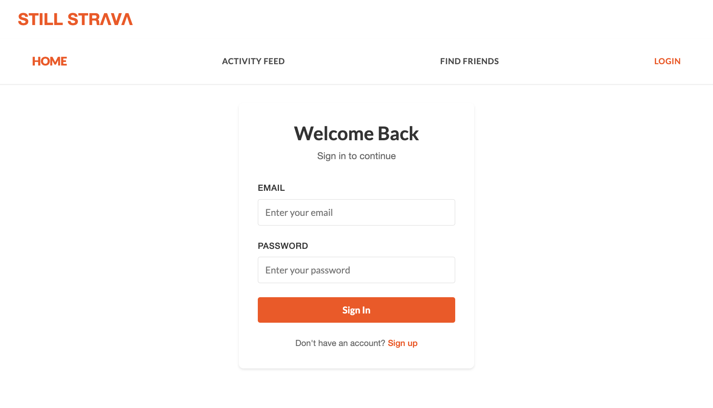
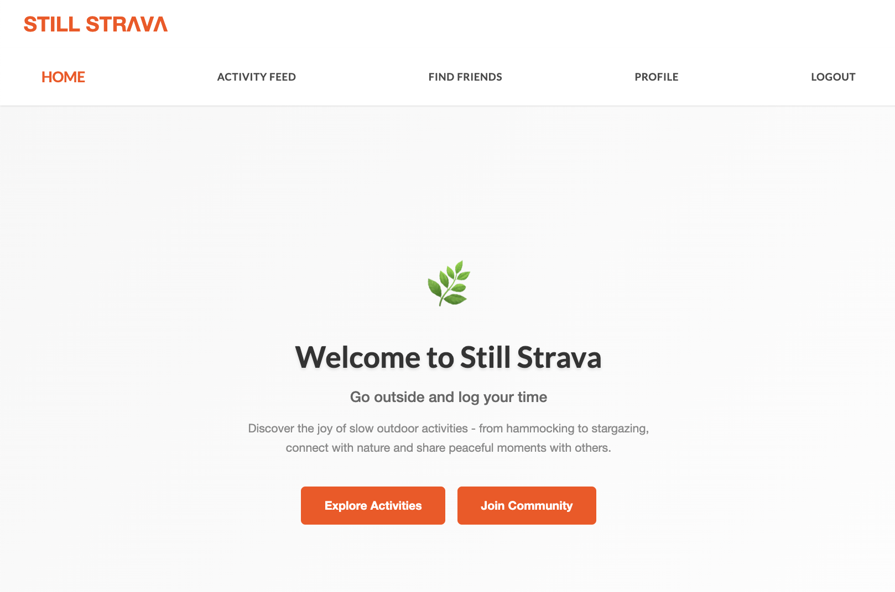
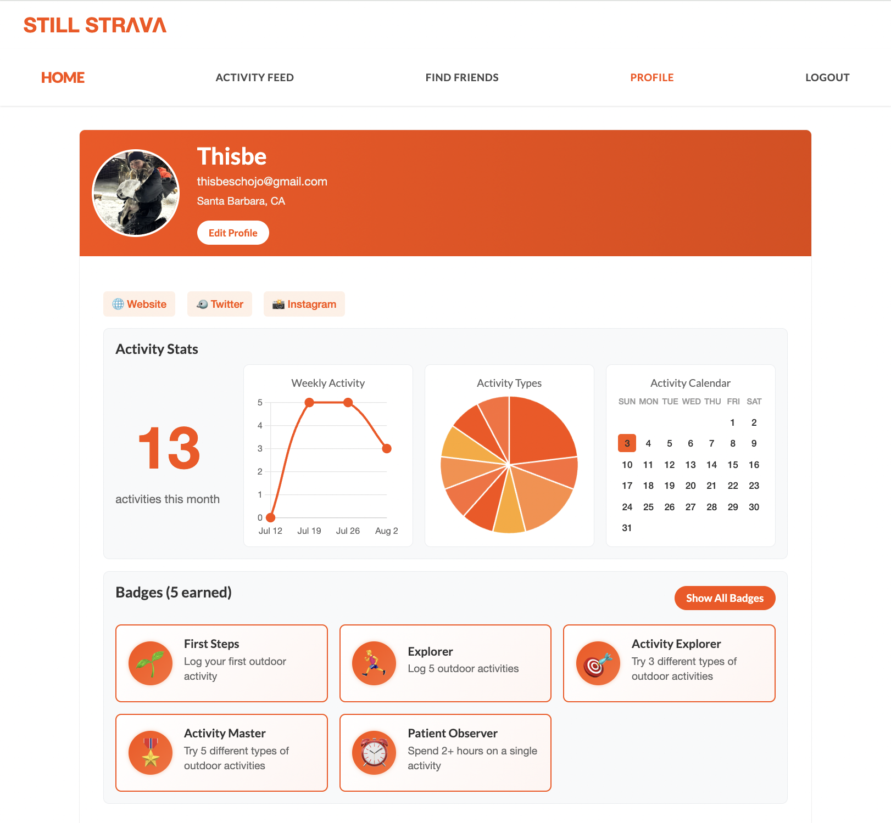
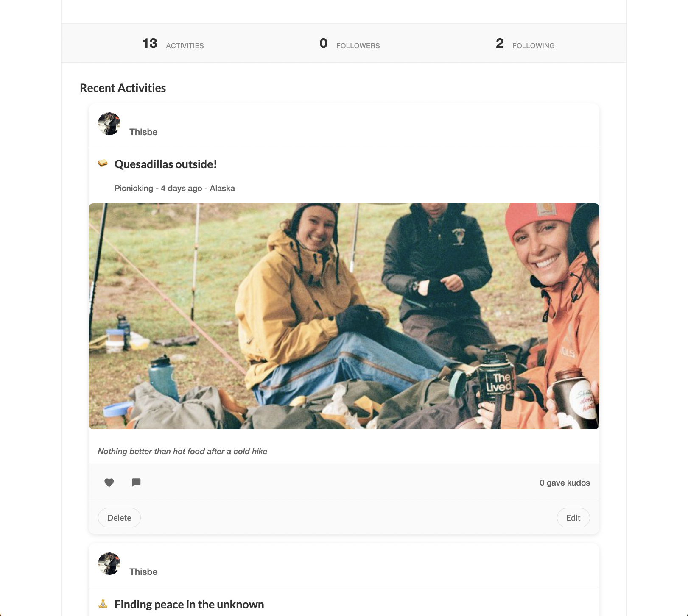
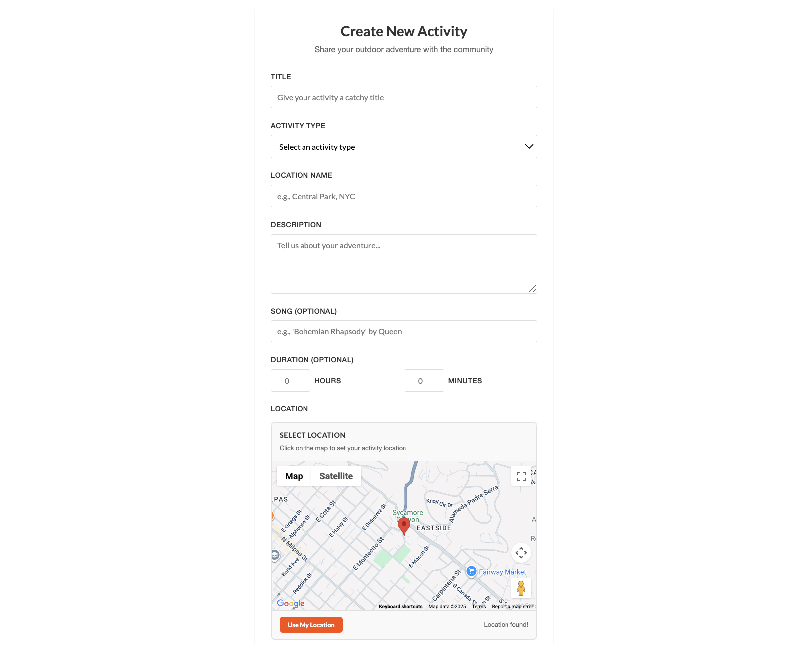
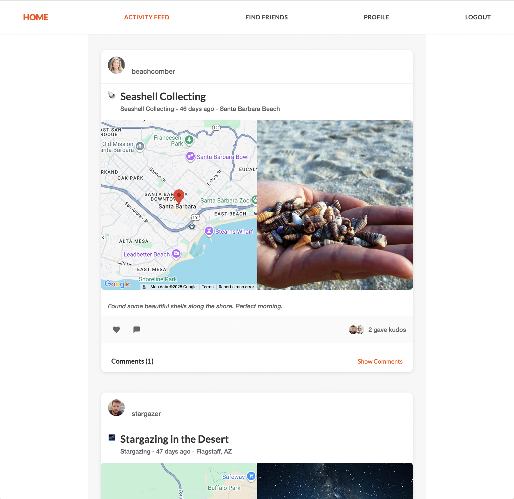
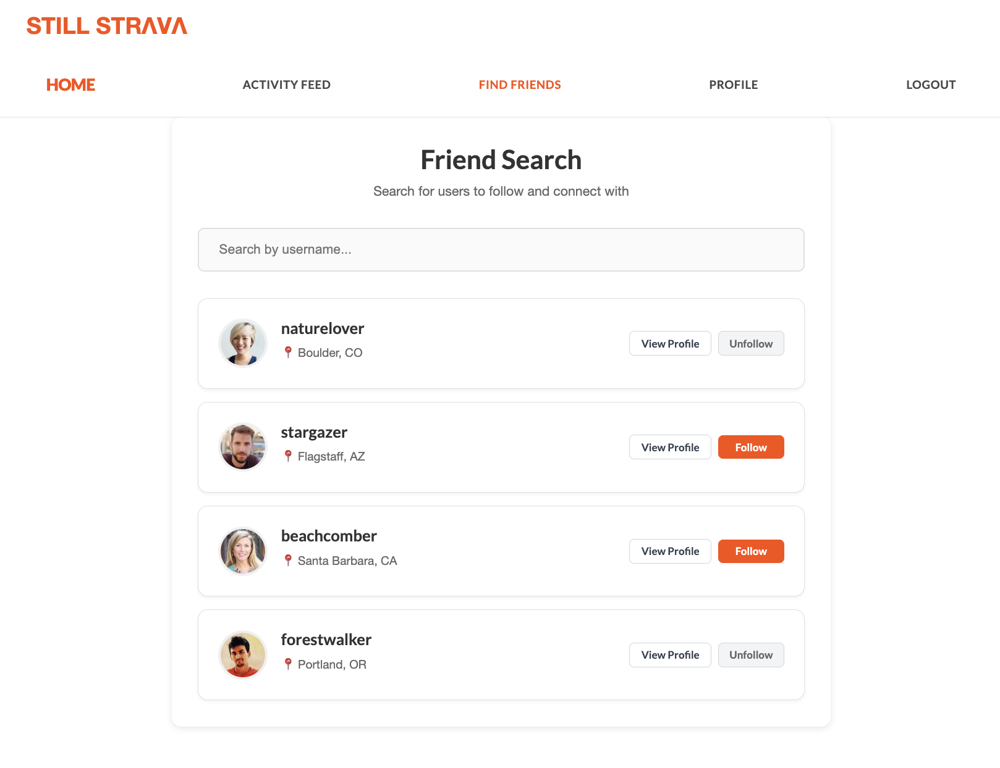

# Still Strava 🌿

A full-stack social fitness application inspired by Strava, built with React and Flask. Still Strava focuses on slow, mindful outdoor activities like hammocking, stargazing, and nature walks - encouraging users to connect with nature and share peaceful moments.

## 🚀 Live Demo

🌐 **[Try Still Strava Now!](https://web-production-158ec.up.railway.app)** - The app is live and ready to use!

🎥 **[Watch the Demo Video](https://www.youtube.com/watch?v=iDY6MuXFTGE)**

## Screenshots

### Login Page



### Home Page



### Profile Page




### Activity Creation




### Activity Feed



### Find Friends



## ✨ Features

- **User Authentication**: Sign up, login, and profile management with JWT tokens
- **Activity Tracking**: Log outdoor activities with photos, location, duration, and descriptions
- **Social Features**: Like activities, leave comments, and follow other users
- **Interactive Maps**: Google Maps integration for activity locations
- **Photo Upload**: Drag & drop file uploads with image compression
- **User Profiles**: Detailed profiles with activity statistics and bio
- **Badge System**: Earn badges for achievements and social engagement
- **Mobile Responsive**: Optimized for mobile and desktop use

## 🛠️ Tech Stack

### Frontend

- **React 18** - Modern React with hooks and functional components
- **React Router v6** - Client-side routing
- **Chart.js v4** - Interactive charts and statistics
- **Google Maps API** - Location services and mapping

### Backend

- **Flask** - Python web framework
- **SQLAlchemy** - ORM for database management
- **PostgreSQL** - Production database on Railway
- **JWT Authentication** - Secure token-based authentication
- **Flask-CORS** - Cross-origin resource sharing

### Deployment

- **Railway** - Frontend and Backend hosting (LIVE!)
- **GitHub** - Version control

## 🌐 Live Application

**Still Strava is now LIVE and accessible to everyone!**

- **🌍 Frontend**: [https://web-production-158ec.up.railway.app](https://web-production-158ec.up.railway.app)
- **🔧 Backend API**: [https://still-strava-production.up.railway.app](https://still-strava-production.up.railway.app)

### What You Can Do Right Now

✅ **Sign up** for a new account  
✅ **Create activities** with photos and locations  
✅ **Follow other users** and build your network  
✅ **Like and comment** on activities  
✅ **Explore the map** to see where activities happened  
✅ **Earn badges** for your achievements

## 🚀 Local Development

### Prerequisites

- Node.js (v16 or higher)
- Python 3.8+
- pipenv

### Setup

1. **Clone and setup backend**:

   ```bash
   git clone https://github.com/ThisbeSchoJo/still-strava.git
   cd still-strava/server
   pipenv install
   pipenv shell
   flask db upgrade head
   python app.py
   ```

2. **Setup frontend**:

   ```bash
   cd ../client
   npm install
   npm start
   ```

3. **Environment Variables** (Optional):
   Create `.env` in `client/` directory:
   ```env
   REACT_APP_API_URL=http://localhost:5555
   REACT_APP_GOOGLE_MAPS_API_KEY=your_google_maps_api_key
   ```

## 🎉 Deployment Success!

**Still Strava is now LIVE and accessible to the world!** 🌍

This full-stack application successfully demonstrates:

- ✅ **React frontend** with modern hooks and context
- ✅ **Flask backend** with RESTful API design
- ✅ **PostgreSQL database** with proper migrations
- ✅ **JWT authentication** and secure user management
- ✅ **Google Maps integration** for location features
- ✅ **Social features** including following, likes, and comments
- ✅ **Production deployment** on Railway

---

**Still Strava** - Connecting people with nature, one peaceful moment at a time. 🌿

**🌐 [Try it now!](https://web-production-158ec.up.railway.app)**
